# React Frontend API 연동 가이드

> React 앱에서 백엔드 REST API와 JWT 인증 연동 방법

## 목차
1. [아키텍처 개요](#1-아키텍처-개요)
2. [인증 흐름](#2-인증-흐름)
3. [API Client 설정](#3-api-client-설정)
4. [인증 상태 관리](#4-인증-상태-관리)
5. [API 호출 패턴](#5-api-호출-패턴)
6. [페이지별 연동](#6-페이지별-연동)

---

## 1. 아키텍처 개요

### 1.1 전체 구조

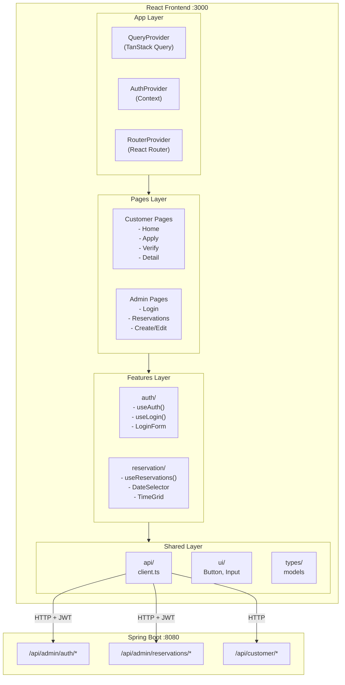

### 1.2 데이터 흐름

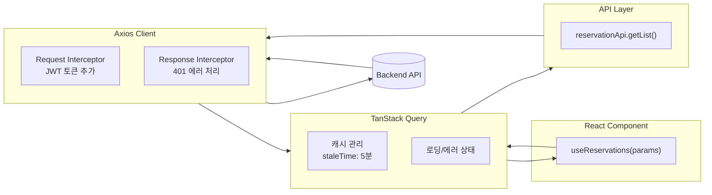

---

## 2. 인증 흐름

### 2.1 로그인 흐름

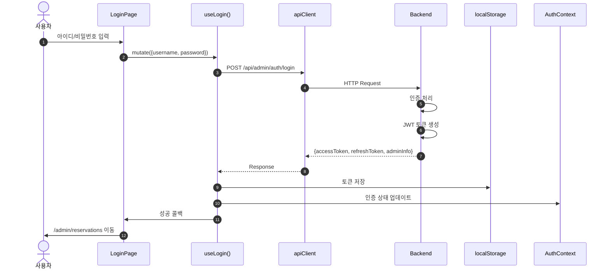

### 2.2 인증된 API 요청 흐름

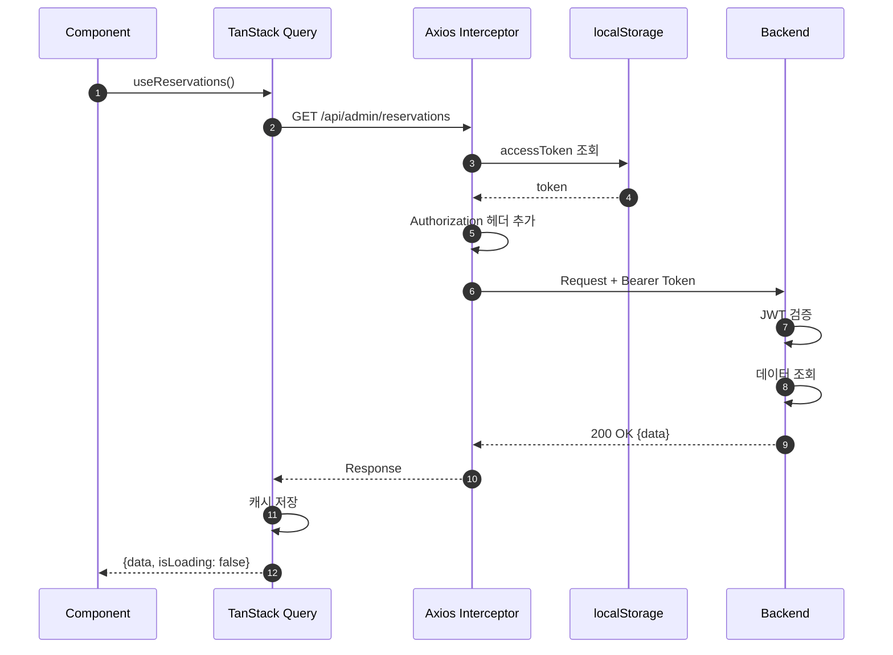

### 2.3 토큰 만료 시 흐름

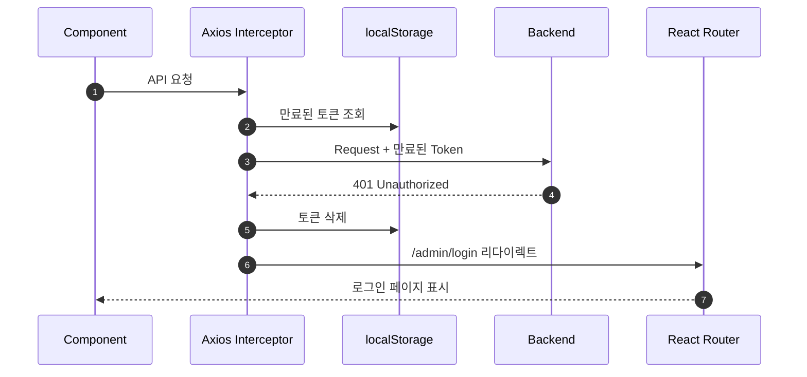

---

## 3. API Client 설정

### 3.1 Axios 설정 구조

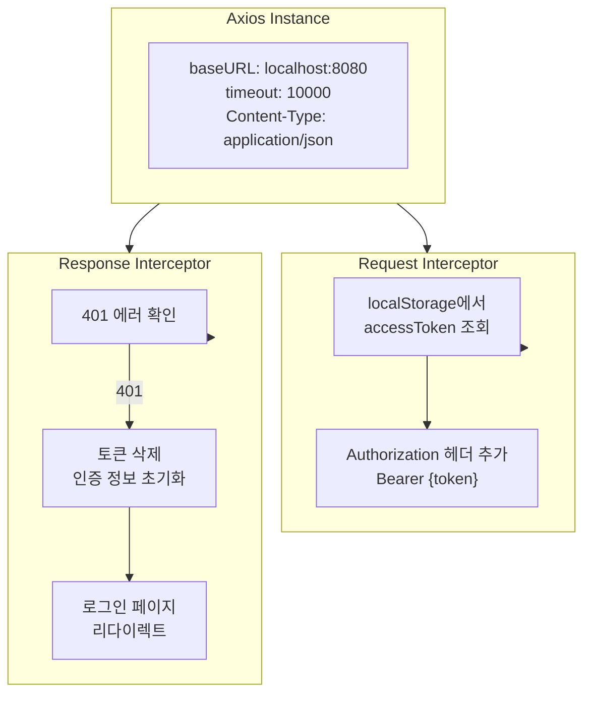

### 3.2 코드

```typescript
// src/shared/api/client.ts

import axios from 'axios'

const API_BASE_URL = import.meta.env.VITE_API_URL || 'http://localhost:8080'

export const apiClient = axios.create({
  baseURL: API_BASE_URL,
  timeout: 10000,
  headers: {
    'Content-Type': 'application/json',
  },
})

// Request Interceptor
apiClient.interceptors.request.use(
  (config) => {
    const token = localStorage.getItem('accessToken')
    if (token) {
      config.headers.Authorization = `Bearer ${token}`
    }
    return config
  },
  (error) => Promise.reject(error)
)

// Response Interceptor
apiClient.interceptors.response.use(
  (response) => response,
  (error) => {
    if (error.response?.status === 401) {
      localStorage.removeItem('accessToken')
      localStorage.removeItem('refreshToken')
      localStorage.removeItem('adminInfo')

      if (window.location.pathname.startsWith('/admin')) {
        window.location.href = '/admin/login'
      }
    }
    return Promise.reject(error)
  }
)
```

---

## 4. 인증 상태 관리

### 4.1 AuthContext 구조

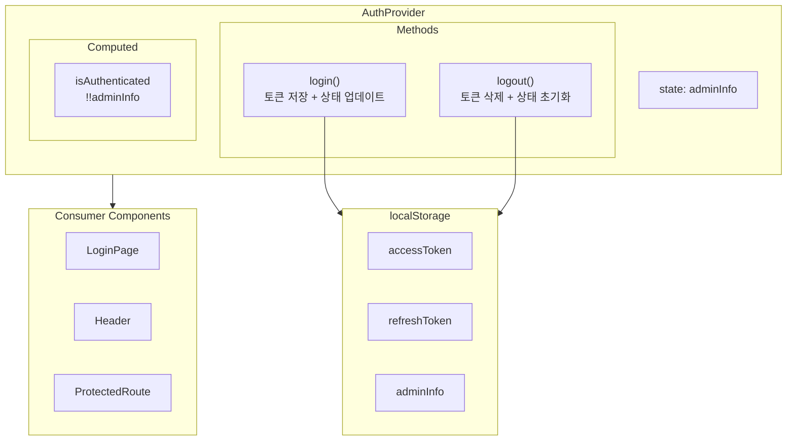

### 4.2 Protected Route 흐름

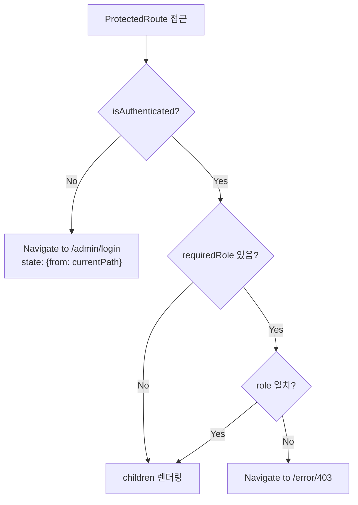

### 4.3 라우터 구조

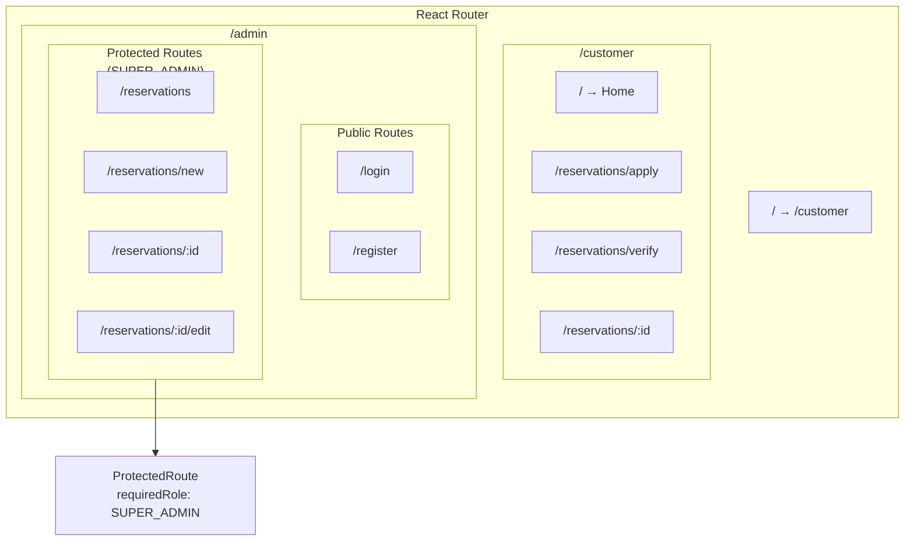

---

## 5. API 호출 패턴

### 5.1 TanStack Query 흐름

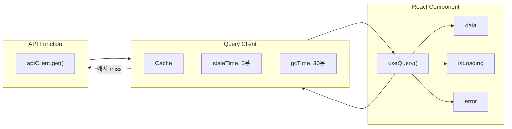

### 5.2 Mutation 흐름

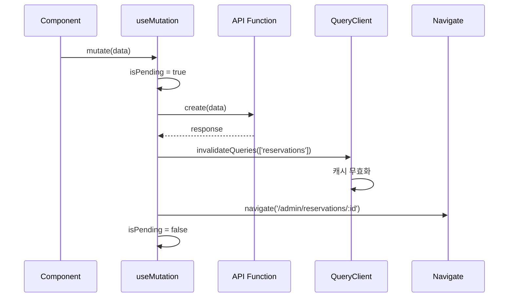

### 5.3 API 엔드포인트 매핑

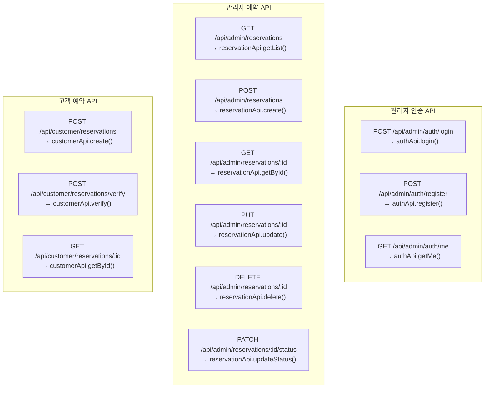

---

## 6. 페이지별 연동

### 6.1 로그인 페이지 흐름

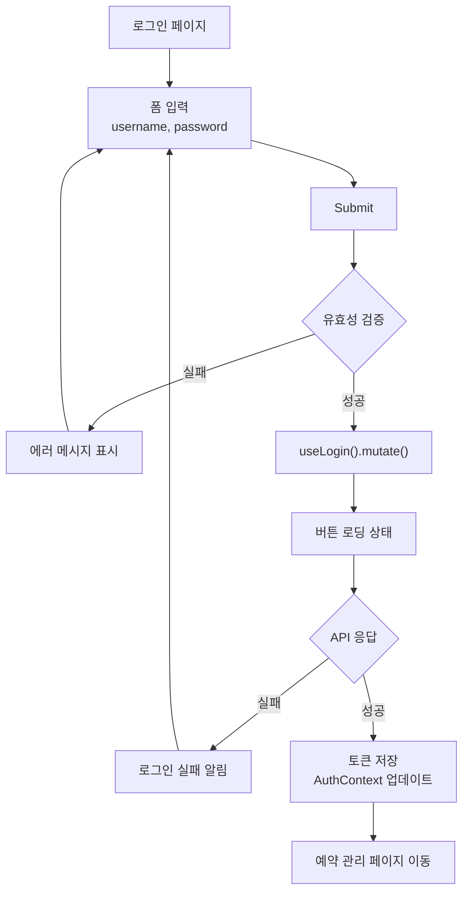

### 6.2 예약 목록 페이지 흐름

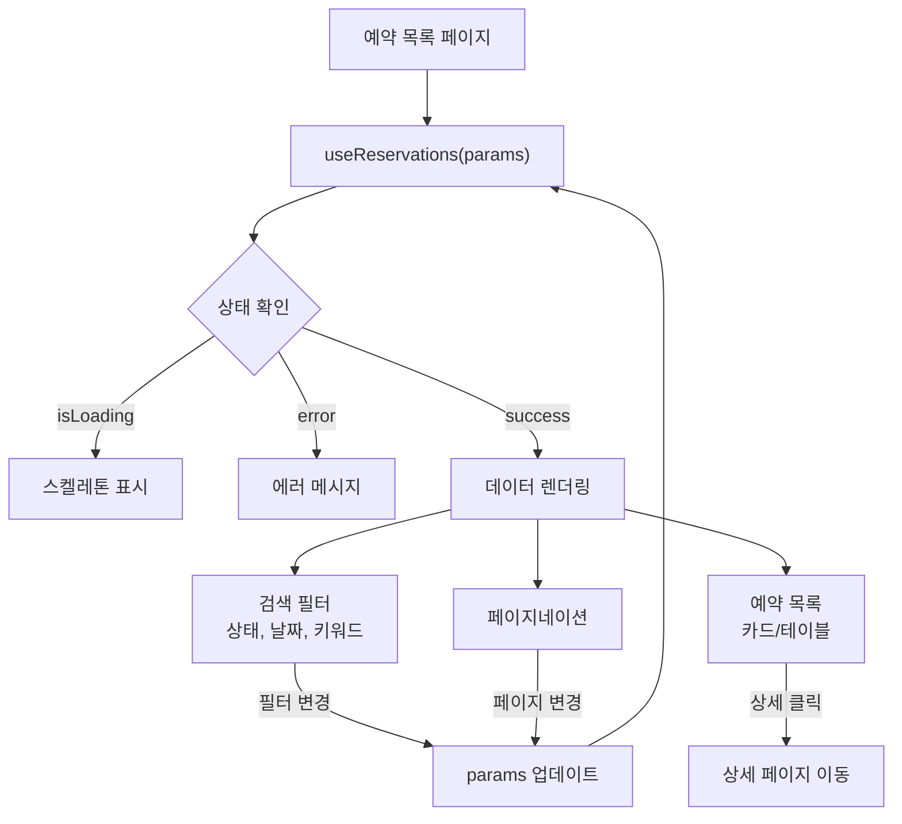

### 6.3 예약 등록 페이지 흐름

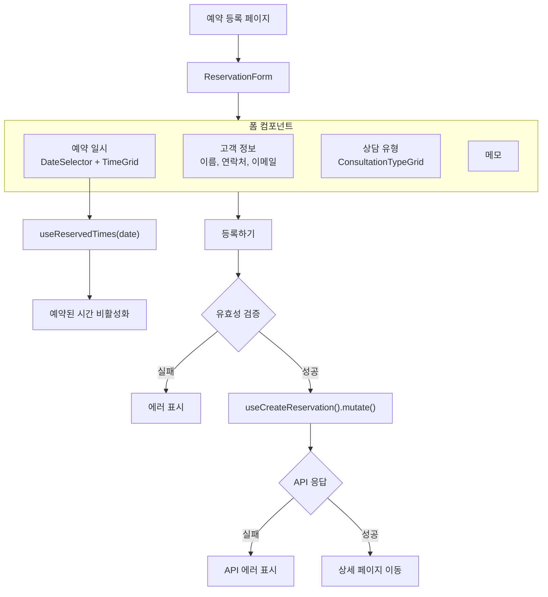

---

## 7. 컴포넌트 관계도

### 7.1 페이지 - 훅 - API 관계

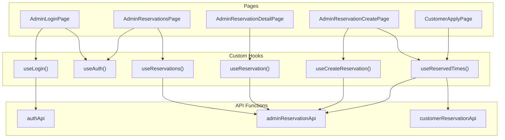

### 7.2 공통 UI 컴포넌트

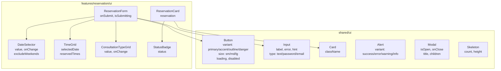

---

## 부록: 타입 정의

```typescript
// src/shared/types/reservation.ts

export type ReservationStatus =
  | 'PENDING'
  | 'CONFIRMED'
  | 'COMPLETED'
  | 'CANCELLED'
  | 'NO_SHOW'

export type ConsultationType =
  | 'TAX_RETURN'
  | 'VAT'
  | 'CORPORATE_TAX'
  | 'INHERITANCE'
  | 'GIFT_TAX'
  | 'BOOKKEEPING'
  | 'TAX_ADJUSTMENT'
  | 'CONSULTATION'
  | 'OTHER'

export interface Reservation {
  id: number
  reservationNumber: string
  customerName: string
  phone: string
  email?: string
  reservationDate: string
  reservationTime: string
  consultationType: ConsultationType
  status: ReservationStatus
  memo?: string
  adminId?: number
  createdAt: string
  updatedAt: string
}
```
